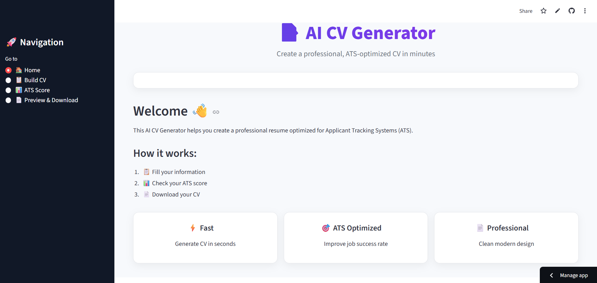

# 🚀 AI CV Generator

An intelligent web application that helps users create professional CVs in seconds using automation and AI-assisted content generation.

Built with **Python** and **Streamlit**, this app allows users to input their personal and professional information, generate a clean and modern CV, preview it instantly, and download it as a PDF.

---

## ✨ Features

- 🧠 AI-powered profile summary generation  
- 📄 Real-time CV preview inside the app  
- ⬇️ One-click PDF download  
- 🖼 Profile photo support  
- 🎨 Custom theme color selection  
- ➕ Dynamic sections (Education, Experience, Projects, etc.)  
- 🌐 Deployed online with Streamlit Cloud  

---

## 🎯 Purpose

This project was built to:

- Simplify CV creation for students and professionals  
- Demonstrate practical use of Python in real-world applications  
- Showcase skills in web app development, UI design, and PDF generation  

---

## 🛠 Tech Stack

- **Frontend & Backend:** Streamlit  
- **PDF Generation:** FPDF  
- **Language:** Python  

---

## 📸 App Screenshot

Here is a preview of the AI CV Generator application:

---

## 🌐 Live Demo

Try the app here:

👉 https://ai-cv-generator-fadil-ade.streamlit.app/

---

## 📄 Demo CV

Download a sample CV generated by the app:

👉 [Download Jane Doe CV](demo/jane_doe_cv.pdf)
